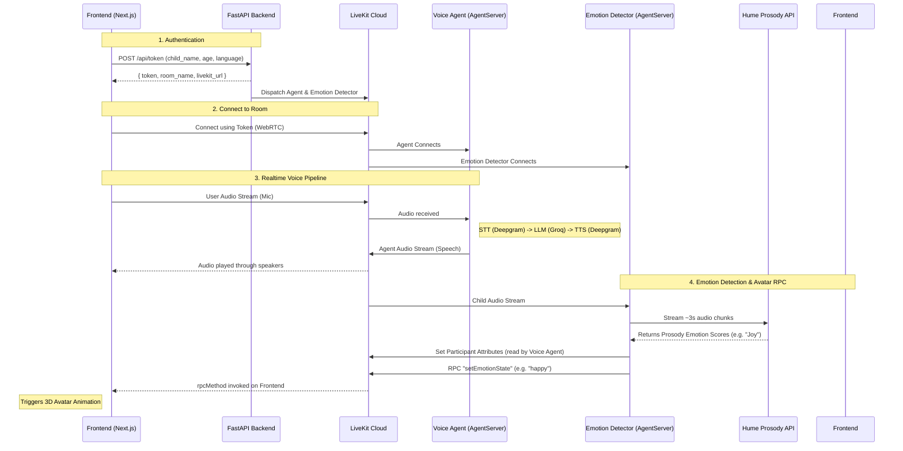
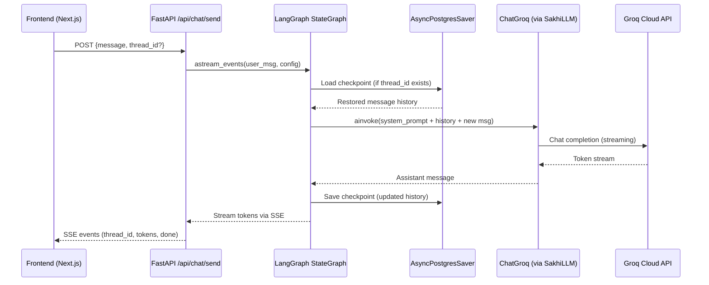

# Sakhi Voice Agent: Architecture Overview

This document describes the architecture of the Sakhi MVP voice agent, focusing on how the frontend and backend interact via LiveKit.

## Core Components

1.  **Frontend (Next.js)**: Handles the UI, microphone/speaker access for voice, text input for chat, and 3D avatar rendering.
2.  **Backend (FastAPI + LiveKit Agents + Hume)**:
    *   **FastAPI**: Serves the core APIs (`/api/token` for Voice MVP, `/api/chat/*` for Chat Mode). 
    *   **Chat Mode (REST)**: Stateless `/api/chat/stream` endpoint that uses Groq LLM to respond to text history and `/api/chat/end` to generate database summaries.
    *   **Voice Agent (LiveKit)**: The Python process that connects to the LiveKit room, listens to the child's audio, talks back, and uses short-term memory to adjust its tone based on the child's emotion.
    *   **Emotion Detector**: A separate "programmatic participant" that silently joins the Voice room, streams the child's audio to the Hume Prosody API, injects emotion data into the voice agent's context, and triggers frontend avatar animations.
3.  **LiveKit Cloud (Voice Only)**: The WebRTC infrastructure that routes realtime audio, video, and data (RPC) between the frontend and the backend voice components.

## Architecture Diagram (Voice Mode)



## How the Voice Pipeline Works

The Python agent uses the LiveKit Agents SDK. The frontend React SDK (`@livekit/components-react`) automatically handles capturing the microphone and playing the agent's audio output.

1.  **Speech-to-Text (STT)**: Deepgram (`nova-3`, multilingual).
2.  **Language Model (LLM)**: Groq (`llama-3.1-8b-instant`). The system prompt is personalized using the child's profile parsed from the token metadata. It also receives short-term emotional context from the Emotion Detector.
3.  **Text-to-Speech (TTS)**: Deepgram (`aura-2-asteria-en`, English).
4.  **Voice Activity Detection (VAD)**: Silero VAD (knows when the child starts and stops speaking).
5.  **Turn Detection**: LiveKit `MultilingualModel` (handles conversational turn-taking).

## Frontend Responsibilities

To integrate with the backend, the frontend Next.js application must:
1.  **Fetch a Token**: Call `/api/token` with the child's details before trying to connect to LiveKit.
2.  **Connect to LiveKit**: Use the `<LiveKitRoom>` React component provided by `@livekit/components-react`, passing in the `serverUrl` and `token`.
3.  **Render the Voice UI**: Inside `<LiveKitRoom>`, use `<VoiceAssistantControlBar>` to enable the microphone and `<RoomAudioRenderer>` to automatically play the agent's voice.
4.  **Listen for RPC (Avatar Animations)**: Register a listener for the `setEmotionState` RPC method on the local participant. When the backend detects an emotion, play the corresponding 3D avatar animation. See `api_contract.md` for payload details.

## Chat Mode Architecture (LangGraph)

The text-based chat mode uses **LangGraph** for orchestration, providing server-side conversation memory via PostgreSQL checkpoints.

### Components

1.  **LangGraph `StateGraph`** (`services/chat_graph.py`): A single-node graph (`chat_node`) that prepends the personalized system prompt and invokes the LLM. Compiled once at startup with an `AsyncPostgresSaver` checkpointer.
2.  **Centralized LLM** (`services/llm.py`): The `SakhiLLM` class exposes both a raw `AsyncGroq` client (for JSON generation) and a LangChain `ChatGroq` model (for the chat pipeline). All model configuration is centralized here.
3.  **PostgreSQL Checkpointer** (`services/checkpointer.py`): Manages the `AsyncPostgresSaver` lifecycle. Each conversation thread gets its own checkpoint, so message history is automatically persisted and restored.
4.  **API Routes** (`api/chat_routes.py`):
    *   `/api/chat/send` — Streams an assistant reply (SSE). Accepts `{message, thread_id?}`.
    *   `/api/chat/history` — Returns the full message history for a thread.
    *   `/api/chat/end` — Summarizes and persists a finished session.

### API Endpoints

| Endpoint | Method | Description |
|---|---|---|
| `/api/chat/send` | `POST` | Stream an assistant reply (SSE) |
| `/api/chat/history` | `POST` | Fetch full message history for a thread |
| `/api/chat/end` | `POST` | Summarize and persist a finished session |

### SSE Event Format (`/api/chat/send`)

Request body:
```json
{ "message": "What is photosynthesis?", "thread_id": "<uuid or null>" }
```

The response is a stream of SSE events:
```
data: {"type": "thread_id", "value": "<uuid>"}   ← First event returns the thread_id
data: {"type": "token",     "value": "Photo..."}  ← One per token
data: {"type": "token",     "value": "synthesis"}
data: {"type": "done"}
```

### Chat Request Flow


